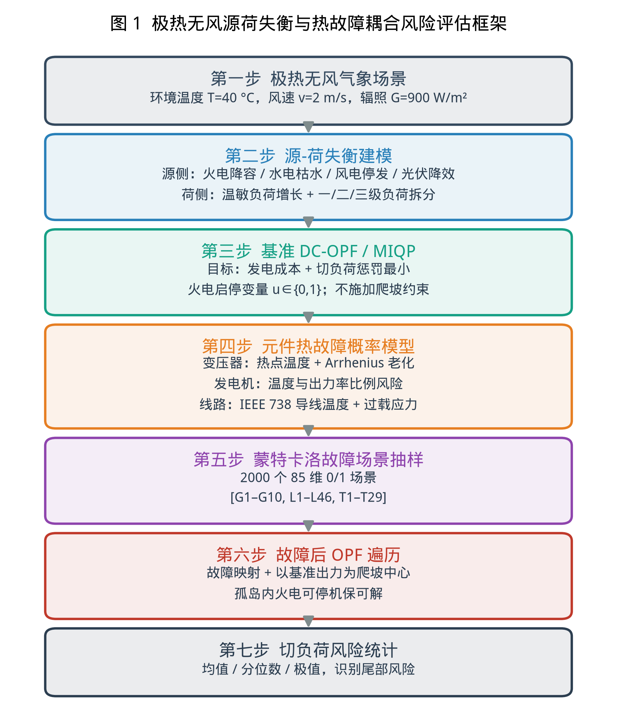
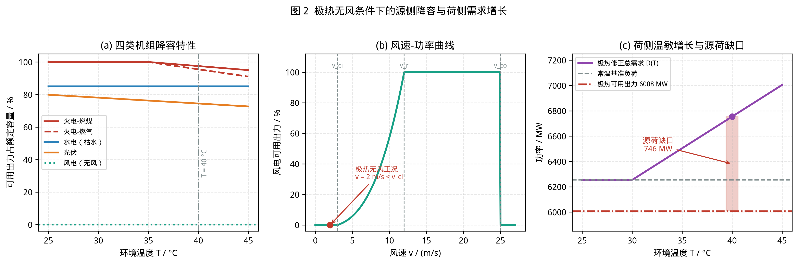
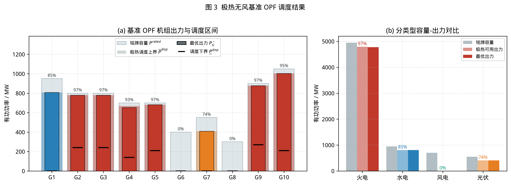
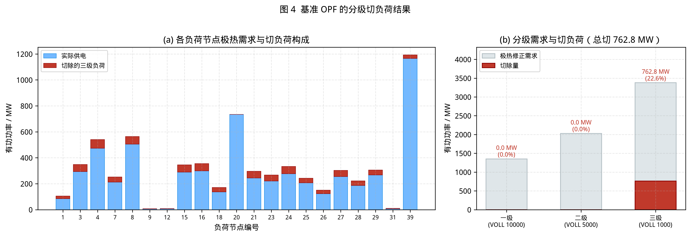
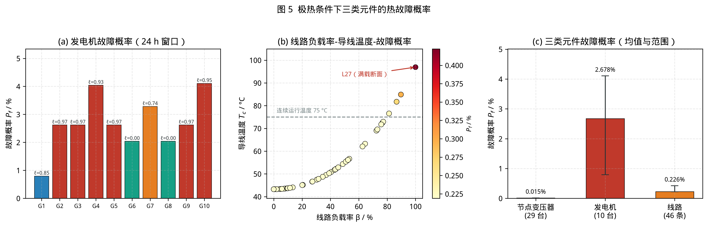
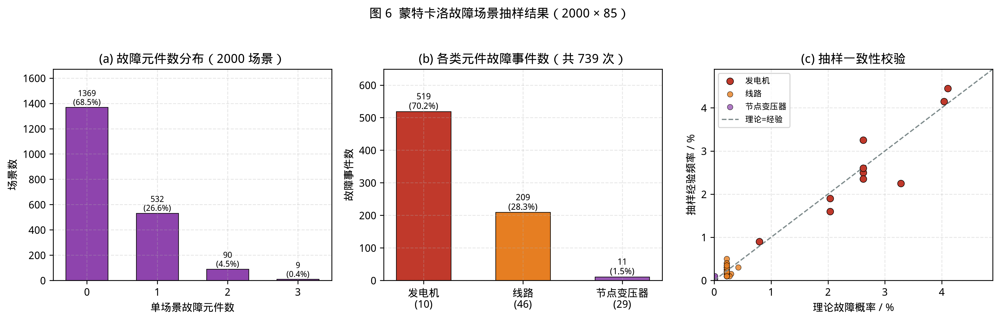
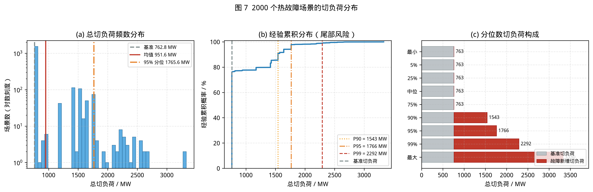
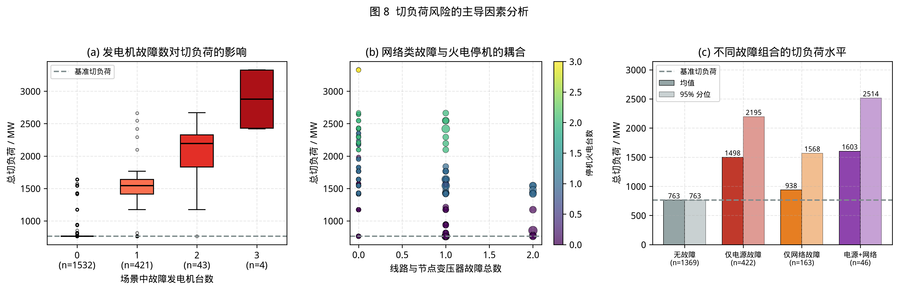

# 计及源荷失衡与热故障耦合的极热无风电力系统风险评估方法

作者A，作者B，作者C

**摘要—** 极热无风复合气象事件会通过源侧可用出力下降、荷侧温敏需求攀升以及电网元件热故障概率升高等多条路径削弱电力系统安全裕度。为刻画该类灾害下源荷失衡与多元件热故障的耦合影响，本文提出一种面向极热无风场景的电力系统运行风险评估方法。首先，分别建立火电高温降容、水电枯水折减、风电低风速出力衰减和光伏温度–辐照修正模型，并结合温敏负荷增长与分级切负荷机制量化源荷供需失衡。其次，以最小化发电成本和切负荷惩罚成本为目标，建立含火电启停变量的直流最优潮流混合整数二次规划模型，求解无元件故障条件下的基准运行状态。再次，基于基准出力、线路潮流和极热环境应力，建立节点变压器、发电机和输电线路的热故障概率模型，并采用蒙特卡洛方法生成多元件故障场景。最后，对各故障场景逐一映射元件退出，并在故障后最优潮流中以基准出力为爬坡参考，统计切负荷分布及尾部风险。基于修改版 IEEE 39 节点系统的算例表明，所提方法能够统一描述极热无风条件下确定性源荷缺口与随机热故障扩展风险，并揭示网络安全约束可使实际切负荷高于原始能量缺口；该方法可为极端气象下电力系统运行风险评估和韧性调度提供量化依据。

**Index Terms—** 极热无风，源荷失衡，直流最优潮流，混合整数二次规划，热故障概率，蒙特卡洛，切负荷。

> Manuscript received Month DD, YYYY; revised Month DD, YYYY.  
> 作者单位、通信作者和资助信息请按 IEEE Transactions 模板在首脚注中补充。

## I. 引言

（按写作要求，本节暂不展开。后续可补充极端高温与静风复合灾害的研究背景、国内外韧性评估与最优潮流研究现状、热故障概率建模进展以及本文创新点。）

## II. 极热无风条件下的源荷失衡建模

极热无风事件具有典型的复合灾害特征：一方面，高温、低风速、枯水和强辐照会改变不同电源类型的可用出力上限；另一方面，高温会抬升空调等温敏负荷需求。本文将源侧降容模型与荷侧温度响应模型统一写入后续最优潮流约束，以获得极热场景下的系统基准运行状态。所提方法的总体框架如图 1 所示。

图 1　极热无风源荷失衡与热故障耦合风险评估框架

### A. 火电机组高温降容模型

火电机组在高温环境下受进气密度下降、循环冷却效率降低和凝汽器背压升高等因素影响，其最大可用出力下降[1]–[3]。对火电机组 $i\in\mathcal{G}_{\mathrm{th}}$，采用线性高温降容模型

$$
P_{G,i}^{\max}(T)=P_{G,i}^{\mathrm{rated}}
\left[1-\alpha_i(T-T_{\mathrm{ref}})\right]^+ ,
\tag{1}
$$

其中，$P_{G,i}^{\mathrm{rated}}$ 为铭牌容量，$T$ 为环境温度，$T_{\mathrm{ref}}$ 为额定参考温度，$\alpha_i$ 为机组类型相关的高温降容系数，$[\cdot]^+=\max(\cdot,0)$。火电机组具有最小技术出力，其极热场景下的最小出力写为

$$
\underline{P}_{G,i}
=\min\left(\lambda_i^{\min}P_{G,i}^{\mathrm{rated}},P_{G,i}^{\max}(T)\right).
\tag{2}
$$

为避免故障场景下孤岛内“最小出力大于可消纳负荷”造成结构性不可行，本文为火电机组引入启停变量 $u_i\in\{0,1\}$。当 $u_i=0$ 时，机组停机且出力为零；当 $u_i=1$ 时，机组在可调度上下界内运行。

### B. 水电、风电和光伏出力修正模型

极热事件常伴随枯水与低水头，水电可用出力以折减系数 $k_{\mathrm{hy}}$ 表示为[4]

$$
P_{H,i}^{\max}=k_{\mathrm{hy}}P_{H,i}^{\mathrm{rated}},
\quad i\in\mathcal{G}_{\mathrm{hy}} .
\tag{3}
$$

在单时段基准状态中，水库可用电量约束可等价折算为水电机组出力上限；水电不设置启停二进制变量，而是在连续区间内优化。

风电出力由风速–功率曲线决定[5],[6]。对风电机组 $i\in\mathcal{G}_{\mathrm{w}}$，其最大出力为

$$
P_{W,i}^{\max}(v)=P_{W,i}^{\mathrm{rated}}
\begin{cases}
0, & v<v_{ci}\ \text{或}\ v>v_{co},\\
\dfrac{v^3-v_{ci}^3}{v_r^3-v_{ci}^3}, & v_{ci}\le v<v_r,\\
1, & v_r\le v\le v_{co},
\end{cases}
\tag{4}
$$

其中，$v_{ci}$、$v_r$ 和 $v_{co}$ 分别为切入、额定和切出风速。极热无风条件下，风速低于切入风速时风电可用出力趋近于零。

光伏最大出力由辐照度和组件温度共同决定[7],[8]。本文采用

$$
P_{PV,i}^{\max}(G,T)
=P_{PV,i}^{\mathrm{rated}}
\frac{G}{G_{\mathrm{STC}}}
\left[1+\gamma\left(T_c-T_{\mathrm{STC}}\right)\right]^+ ,
\tag{5}
$$

其中，$G$ 为太阳辐照度，$G_{\mathrm{STC}}$ 为标准测试辐照度，$\gamma$ 为温度功率系数，$T_c$ 为电池温度。电池温度由环境温度和辐照度通过 NOCT 模型估计。

### C. 温敏负荷增长与分级切负荷模型

负荷侧将每个负荷节点的基准需求 $P_{D,j}^0$ 分为刚性负荷和温敏负荷[9],[10]。设刚性比例为 $\rho_{\mathrm{rigid}}$，温敏比例为 $\rho_{\mathrm{cool}}$，则极热温度 $T$ 下节点 $j$ 的修正需求为

$$
D_j(T)=\rho_{\mathrm{rigid}}P_{D,j}^{0}
+\rho_{\mathrm{cool}}P_{D,j}^{0}
\left[1+\beta(T-T_{L0})\right]^+ ,
\tag{6}
$$

其中，$\beta$ 为温度灵敏度，$T_{L0}$ 为舒适基准温度。为反映不同负荷的重要性，本文将每个负荷节点进一步划分为一级关键负荷、二级重要负荷和三级可中断负荷[11]，并设置差异化失负荷价值 $\mathrm{VOLL}_k$[12]。第 $j$ 个负荷节点第 $k$ 级切负荷变量为 $s_{j,k}$，满足

$$
0\le s_{j,k}\le D_{j,k}(T),
\quad j\in\mathcal{D},\ k=1,2,3 .
\tag{7}
$$

该设置使最优潮流模型能够在供需缺口存在时优先保障关键负荷，并将切负荷集中于低惩罚等级负荷。

图 2 给出了上述源侧降容模型与荷侧温敏增长模型的特性曲线。由图 2(a) 可见，燃气机组对环境温度的敏感性高于燃煤机组，水电受枯水条件影响的折减幅度最大，光伏则随电池温度升高而持续降容；由图 2(b) 可见，极热无风工况下风速低于切入风速，风电可用出力趋近于零；由图 2(c) 可见，随着温度升高，荷侧需求单调上升而源侧可用出力下降，二者共同形成显著的源荷缺口。

图 2　极热无风条件下的源侧降容与荷侧需求增长

## III. 基准运行状态的 DC-OPF/MIQP 模型

在极热无风场景下，本文首先求解无元件故障的源荷失衡基准最优潮流。由于基准 OPF 描述的是极端气象冲击后的静态运行快照，且未知上一时刻机组实际出力，基准 OPF 不施加爬坡约束；故障后 OPF 则以该基准出力为爬坡参考。

### A. 决策变量与目标函数

基准 OPF 的决策变量包括机组有功出力 $P_{G,i}$、火电启停状态 $u_i$、节点电压相角 $\theta_n$ 以及分级切负荷量 $s_{j,k}$。优化目标为发电成本与切负荷惩罚成本之和：

$$
\min
\sum_{i\in\mathcal{G}}\left(c_{2,i}P_{G,i}^{2}+c_{1,i}P_{G,i}\right)
+\sum_{j\in\mathcal{D}}\sum_{k=1}^{3}\mathrm{VOLL}_{k}s_{j,k}.
\tag{8}
$$

由于目标函数含机组二次发电成本，且火电启停状态为二进制变量，该模型为混合整数二次规划（MIQP）。MATLAB 主实现采用 Gurobi 求解，Python 验证实现通过枚举火电启停组合并求解连续二次规划复现同一模型。

### B. 直流潮流约束

设系统基准容量为 $S_B$，节点电纳矩阵为 $\mathbf{B}$，支路串联电纳由电抗和变比构造。节点 $n$ 的功率平衡约束为

$$
S_B(\mathbf{B}\boldsymbol{\theta})_n
-\sum_{i\in\mathcal{G}(n)}P_{G,i}
-\sum_{k=1}^{3}s_{n,k}
=-D_n(T),\quad \forall n .
\tag{9}
$$

支路 $l=(m,n)$ 的直流潮流为

$$
f_l=S_B b_l(\theta_m-\theta_n),
\tag{10}
$$

并满足热稳限额

$$
-\overline{f}_l\le f_l\le \overline{f}_l,\quad \forall l .
\tag{11}
$$

平衡节点相角固定为

$$
\theta_{\mathrm{slack}}=0 .
\tag{12}
$$

### C. 源侧运行约束

基准 OPF 中，火电机组不施加爬坡约束，开机状态下的调度区间为

$$
\underline{P}_{G,i}^{\mathrm{disp}}=\underline{P}_{G,i},
\quad
\overline{P}_{G,i}^{\mathrm{disp}}=P_{G,i}^{\max}(T).
\tag{13}
$$

火电启停约束为

$$
u_i\underline{P}_{G,i}^{\mathrm{disp}}
\le P_{G,i}\le
u_i\overline{P}_{G,i}^{\mathrm{disp}},
\quad u_i\in\{0,1\},\quad i\in\mathcal{G}_{\mathrm{th}} .
\tag{14}
$$

水电、风电和光伏机组均以连续变量形式参与优化，分别受式 (3)--(5) 给出的极热可用出力上限约束。风电和光伏可在可用出力范围内弃风弃光，水电受枯水可用出力和单时段能量上限约束。

## IV. 极热条件下元件热故障概率模型

极热无风不仅造成确定性源荷缺口，还会抬升电力元件故障概率。本文在基准 OPF 得到的发电机出力、线路潮流和节点状态基础上，分别建立节点变压器、发电机和线路的故障概率模型。三类元件统一采用“应力相关故障率—评估窗口故障概率”框架。设元件在极热条件下的故障率为 $\lambda$，评估窗口为 $\Delta t$，则其故障概率为

$$
P_f=1-\exp(-\lambda\Delta t).
\tag{15}
$$

### A. 节点变压器故障概率

本文将每个非电源节点配置一台同型号节点变压器。由于 DC-OPF 仅含有功功率，不包含无功功率和电压幅值，无法构造物理上完整的视在负载比，因此节点变压器故障概率不采用有功负载比驱动，而采用环境温度驱动的热点温度模型[13]–[17]。

按 IEEE C57.91 负载导则[13]，变压器在额定负载设计条件下的热点温度可写为

$$
\theta_H=\theta_a+\Delta\theta_{HS,R},
\quad
\Delta\theta_{HS,R}=\Delta\theta_{TO,R}+\Delta\theta_{H,R},
\tag{16}
$$

其中，$\theta_a$ 为环境温度，$\Delta\theta_{TO,R}$ 为额定顶层油温升，$\Delta\theta_{H,R}$ 为额定热点对顶油温差。绝缘热老化采用 Arrhenius 加速因子[14]–[17]

$$
F_{AA}(\theta_H)=
\exp\left(
\frac{B}{\theta_{H,\mathrm{ref}}+273}
-\frac{B}{\theta_H+273}
\right),
\tag{17}
$$

则节点变压器故障率和故障概率分别为

$$
\lambda_T=\lambda_{T,0}F_{AA}(\theta_H),
\quad
P_f^T=1-\exp(-\lambda_T\Delta t).
\tag{18}
$$

### B. 发电机故障概率

发电机故障概率受环境温度、有效工作温度和出力率共同影响[18]–[20]。对机组 $i$，定义出力率

$$
\ell_i=\frac{P_{G,i}}{P_{G,i}^{\mathrm{rated}}}.
\tag{19}
$$

采用比例风险模型描述温度应力与出力应力对强迫停运率的放大作用[19]：

$$
\lambda_{G,i}
=\lambda_{0,\tau(i)}
\exp\left[
a_T^{\tau(i)}(T_{\mathrm{eff},i}-T_0)
+a_L^{\tau(i)}\ell_i
\right],
\tag{20}
$$

$$
P_f^{G_i}=1-\exp(-\lambda_{G,i}\Delta t).
\tag{21}
$$

其中，$\tau(i)$ 表示机组类型，$T_{\mathrm{eff},i}$ 为有效温度应力。火电、水电和风电取环境温度，光伏取电池温度，以反映光伏组件和逆变设备在高温下可靠性降低的影响。

### C. 线路故障概率

线路故障概率由线路潮流、导线电流和导线温度共同决定[21]–[25]。基于基准 OPF 得到的支路潮流 $f_l$，定义负载率

$$
\beta_l=\frac{|f_l|}{\overline{f}_l}.
\tag{22}
$$

将负载率换算为导线电流后，采用 IEEE 738 稳态热平衡计算导线温度 $T_{c,l}$[21]。线路故障率采用温度应力和过载应力指数放大模型：

$$
\lambda_{L,l}=\lambda_{L,0}
\exp\left[
b_T(T_{c,l}-T_{c,\mathrm{ref}})^+
+b_S(\beta_l-1)^+
\right],
\tag{23}
$$

$$
P_f^{L_l}=1-\exp(-\lambda_{L,l}\Delta t).
\tag{24}
$$

式中，$b_T$ 和 $b_S$ 分别为温度应力和过载应力系数。该模型能够反映极热、无风和强辐照条件下导线散热能力下降、导线温度升高以及过载风险增加对线路停运概率的影响。

## V. 蒙特卡洛故障场景与故障后 OPF 遍历

### A. 故障场景抽样

在三类元件故障概率计算完成后，本文采用蒙特卡洛抽样生成多元件故障场景。每个故障场景表示为

$$
\mathbf{z}^{(s)}
=\left[
z_{s,1}^{G},\ldots,z_{s,n_G}^{G},
z_{s,1}^{L},\ldots,z_{s,n_L}^{L},
z_{s,1}^{T},\ldots,z_{s,n_T}^{T}
\right]^{\mathsf T}\in\{0,1\}^{n_c},
\tag{25}
$$

其中，$0$ 表示元件故障，$1$ 表示元件良好，$n_c=n_G+n_L+n_T$。对第 $i$ 个元件，若其故障概率为 $p_i$，则令

$$
z_i^{(s)}=
\begin{cases}
0, & u_i^{(s)}<p_i,\\
1, & u_i^{(s)}\ge p_i,
\end{cases}
\quad u_i^{(s)}\sim U(0,1).
\tag{26}
$$

该场景集可用于后续故障后 OPF、失负荷统计和系统风险分布估计。

### B. 故障映射规则

对每个场景，故障元件通过以下规则映射到故障后 OPF：

1) 若发电机 $g$ 故障，则令 $P_{G,g,s}=0$。若该发电机为火电机组，则同时强制 $u_{g,s}=0$。  
2) 若线路 $l$ 故障，则该支路退出网络，其电纳不再参与 $\mathbf{B}_{\mathrm{bus}}$ 装配。  
3) 若节点变压器 $t$ 故障，则其所在非电源节点的所有关联支路退出。令 $a_{s,l}$ 为场景 $s$ 中支路 $l$ 的最终可用性，则

$$
a_{s,l}=z_{s,l}^{L}
\prod_{t:\,b_t\in\{f_l,t_l\}}z_{s,t}^{T}.
\tag{27}
$$

该映射将节点变压器故障转化为相关支路的拓扑退出，从而在 DC-OPF 中刻画节点供电通道受损的影响。

### C. 故障后 OPF 模型

故障后 OPF 沿用式 (8)--(12) 的目标函数和网络约束，但拓扑矩阵、机组可用性和调度区间均随场景变化。与基准 OPF 不同，故障后 OPF 以基准 OPF 最优出力 $P_{G,i}^{\star}$ 为爬坡中心。火电机组开机状态下的可调度区间为

$$
\underline{P}_{G,i,s}^{\mathrm{disp}}
=\max\left(
\underline{P}_{G,i},
P_{G,i}^{\star}-R_i^{\downarrow}\Delta t
\right),
\tag{28}
$$

$$
\overline{P}_{G,i,s}^{\mathrm{disp}}
=\min\left(
P_{G,i}^{\max}(T),
P_{G,i}^{\star}+R_i^{\uparrow}\Delta t
\right).
\tag{29}
$$

并施加

$$
u_{i,s}\underline{P}_{G,i,s}^{\mathrm{disp}}
\le P_{G,i,s}\le
u_{i,s}\overline{P}_{G,i,s}^{\mathrm{disp}},
\quad u_{i,s}\in\{0,1\}.
\tag{30}
$$

水电机组不设置启停变量，但在故障后 OPF 中按基准水电出力施加爬坡区间。引入火电启停变量后，若网络故障导致局部孤岛负荷不足，火电机组可通过停机避免最小出力约束造成不可行，从而提高故障后 OPF 的可解性。

## VI. 算例设置与结果分析

### A. 修改版 IEEE 39 节点系统

本文以 MATPOWER case39 系统为基础构造修改版 IEEE 39 节点算例。系统包含 39 个节点、46 条支路和 10 台发电机。为适配极热无风源荷失衡分析，原始机组被重新配置为火电、水电、风电和光伏四类电源；负荷节点按温度敏感性和重要等级进行拆分；支路电抗、热稳限额和平衡节点设置保留 IEEE 39 节点系统的基本拓扑特征。

表 I 给出算例的主要设置。

**表 I 修改版 IEEE 39 节点算例概况**

| 项目 | 设置 |
|---|---|
| 网络拓扑 | 39 节点、46 支路 |
| 电源类型 | 火电、水电、风电、光伏 |
| 负荷类型 | 刚性负荷与温敏负荷；一级、二级和三级负荷 |
| 潮流模型 | 直流潮流 |
| 基准 OPF | 不施加爬坡约束，含火电启停 |
| 故障后 OPF | 以基准出力为爬坡参考，含元件故障映射 |
| 故障元件 | 发电机、线路、节点变压器 |

### B. 基准 OPF 结果

在极热无风场景下，风电因风速低于切入风速而基本不可用，光伏受电池温度升高影响发生降容，水电受枯水条件折减，火电机组因高温冷却能力下降而降低可用出力。同时，温敏负荷随温度升高而增加。源侧降容和荷侧增长共同形成确定性供需缺口。

表 II 给出基准 OPF 的主要求解结果。结果显示，模型在保障一级和二级负荷的前提下，仅切除三级可中断负荷，说明分级切负荷惩罚机制能够引导优化模型优先保护关键负荷。

**表 II 极热无风基准 OPF 汇总结果**

| 指标 | 数值 |
|---|---:|
| 求解状态 | optimal |
| 目标函数最优值 ($/h) | 1011492.52 |
| 发电成本 ($/h) | 248686.62 |
| 切负荷惩罚成本 ($/h) | 762805.90 |
| 总发电 (MW) | 5991.76 |
| 极热修正总需求 (MW) | 6754.57 |
| 总切负荷 (MW) | 762.81 |
| 总切负荷比例 | 11.29% |
| 线路最大负载率 | 100.00% |
| 越限线路数 | 0 |

进一步从能量平衡角度分解切负荷来源。在 40 °C 极热无风工况下，四类电源经降容修正后的系统可用出力上界约为 6008.36 MW，极热修正后的系统总需求约为 6754.57 MW，二者之差所对应的源荷原始能量缺口约为 746.21 MW。而基准 OPF 的最优切负荷为 762.81 MW，较原始能量缺口高出约 16.60 MW。该差值并非模型误差，而是来自网络安全约束：燃气机组 G4 的极热降容调度上界为 668.5 MW，但在支路热稳限额约束下其最优出力被限制在 651.9 MW，未能顶到降容上界，闲置发电能力恰好约为 16.6 MW。由此可得关系

$$
P_{\mathrm{shed}}^{\star}
=\bigl(D(T)-P^{\mathrm{avail}}(T)\bigr)
+\bigl(P^{\mathrm{avail}}(T)-P_G^{\star}\bigr),
\tag{31}
$$

即最优切负荷等于原始能量缺口与受网络约束闲置的可用发电能力之和。该结果表明，极热无风场景下的切负荷不仅由源荷能量缺口决定，还受输电网阻塞与热稳限额的显著影响。

从机组出力看，水电、光伏和多数火电机组接近或达到极热修正后的可用上限，风电出力为零，表明系统在该场景下已处于源侧能力紧张状态。基准 OPF 不施加爬坡约束，火电调度下界取最小技术出力；故障后分析再以该基准出力作为爬坡中心。

基准 OPF 的机组调度结果如图 3 所示。由图 3(a) 可见，除受网络安全约束限制的燃气机组 G4 外，其余可调机组均运行在极热修正后的调度上界附近；由图 3(b) 可见，四类电源中风电可用出力降至零，光伏与水电分别折减至约 74% 和 85%，火电降容幅度相对较小。

图 3　极热无风基准 OPF 调度结果

基准 OPF 的切负荷分布如图 4 所示。由图 4(a) 可见，切负荷分散于各负荷节点，且均来自三级可中断负荷；由图 4(b) 可见，一级和二级负荷被切除量均为零，验证了分级惩罚机制对关键负荷的保障作用。

图 4　基准 OPF 的分级切负荷结果

### C. 故障概率与蒙特卡洛场景

在基准 OPF 得到的机组出力和支路潮流基础上，本文计算 10 台发电机、46 条线路和 29 台节点变压器的故障概率，并按固定随机种子生成 2000 个 85 维故障场景。故障场景向量按“发电机—线路—节点变压器”的顺序排列，其中 0 表示元件故障，1 表示元件正常。

表 III 给出故障场景集合的统计特征。可以看出，单个元件故障概率总体较低，但在多元件系统和多场景采样下，仍会形成相当数量的含故障场景，为评估尾部切负荷风险提供了必要样本。

**表 III 蒙特卡洛故障场景统计**

| 指标 | 数值 |
|---|---:|
| 场景数 | 2000 |
| 每个场景维数 | 85 |
| 总故障事件数 | 739 |
| 至少含一个故障的场景数 | 631 |
| 单场景最大故障元件数 | 3 |
| 发电机故障事件数 | 519 |
| 线路/支路故障事件数 | 209 |
| 节点变压器故障事件数 | 11 |

三类元件的故障概率计算结果如图 5 所示。由图 5(a) 可见，燃气机组因温度敏感系数较大且出力率较高，故障概率明显高于其他机组；由图 5(b) 可见，线路故障概率随负载率升高而显著上升，满载断面对应的导线温度已超过连续运行温度限值；由图 5(c) 可见，发电机故障概率整体高于线路和节点变压器，是本算例中主导的故障来源。

图 5　极热条件下三类元件的热故障概率

蒙特卡洛抽样结果如图 6 所示。由图 6(a) 可见，约 68.5% 的场景不含故障元件，含单一故障的场景占 26.6%，多重故障场景占比较小但构成尾部风险的主要来源；由图 6(b) 可见，发电机故障事件占全部故障事件的 70.2%；由图 6(c) 可见，各元件的抽样经验频率与理论故障概率基本吻合，验证了抽样过程的正确性。

图 6　蒙特卡洛故障场景抽样结果（2000 × 85）

### D. 故障后 OPF 遍历结果

对所有蒙特卡洛场景逐一求解故障后 OPF。由于模型在故障后 OPF 中保留火电启停变量，能够处理网络分裂或局部负荷不足情况下的最小出力过剩问题，全部故障场景均获得可行最优解。表 IV 给出总切负荷及相对基准新增切负荷的分布。

**表 IV 故障后 OPF 切负荷分布**

| 统计量 | 总切负荷 (MW) | 相对基准新增切负荷 (MW) |
|---|---:|---:|
| 最小值 | 762.806 | 0.000 |
| 平均值 | 951.578 | 188.772 |
| 标准差 | 377.126 | 377.126 |
| 5% 分位 | 762.806 | 0.000 |
| 25% 分位 | 762.806 | 0.000 |
| 中位数 | 762.806 | 0.000 |
| 75% 分位 | 762.806 | 0.000 |
| 90% 分位 | 1542.806 | 780.000 |
| 95% 分位 | 1765.556 | 1002.750 |
| 99% 分位 | 2292.206 | 1529.400 |
| 最大值 | 3330.397 | 2567.592 |

结果表明，多数场景未显著增加基准切负荷，但高分位和最大值场景显示出显著尾部风险。高切负荷场景主要由大容量火电机组故障或停机、关键支路退出以及节点变压器故障引发的网络可达性下降共同造成。统计中共有 388 个场景出现至少一台火电关停，包括故障强制停机和孤岛安全停机。这说明火电启停变量不仅是求解可行性的技术处理，也反映了极端故障后系统运行方式的必要调整。

切负荷的统计分布如图 7 所示。由图 7(a) 可见，切负荷呈明显的右偏分布，大量场景集中于基准切负荷附近，而少数场景切负荷显著增大；由图 7(b) 可见，经验累积分布在约 75% 分位处出现明显拐点，此后曲线迅速右移，表明系统风险主要集中在分布尾部；由图 7(c) 可见，90% 分位以上场景的故障新增切负荷已超过基准切负荷本身。

图 7　2000 个热故障场景的切负荷分布

为进一步识别风险主导因素，图 8 给出了切负荷与故障构成之间的关系。由图 8(a) 可见，切负荷随故障发电机台数增加而单调上升，三台机组同时故障时切负荷中位数接近 2900 MW；由图 8(b) 可见，网络类故障在引发火电停机时会进一步放大切负荷；由图 8(c) 可见，电源故障对切负荷的影响强于单纯的网络故障，而电源与网络故障同时发生的场景对应最高的切负荷水平。

图 8　切负荷风险的主导因素分析

### E. 交叉验证与实现一致性

本文同时给出 MATLAB/Gurobi 主实现和 Python 开源验证实现。MATLAB 版本负责模型装配和 MIQP 求解，Python 版本通过枚举火电启停组合并求解连续二次规划复现同一优化模型；矩阵形式验证脚本进一步逐元素对比 Gurobi 标准型装配。基准 OPF、故障概率、蒙特卡洛场景和故障后 OPF 的结果文件均由脚本生成，保证了算例流程的可复现性。

## VII. 结论

本文提出了一种计及源荷失衡与热故障耦合的极热无风电力系统风险评估方法。该方法首先通过四类电源降容模型和温敏负荷增长模型刻画极端气象造成的确定性供需缺口；其次，建立含火电启停变量的 DC-OPF/MIQP 模型求解基准运行状态；再次，结合节点变压器、发电机和线路的热故障概率模型生成蒙特卡洛故障场景；最后，通过故障后 OPF 遍历得到切负荷分布和尾部风险。

基于修改版 IEEE 39 节点系统的算例结果表明：极热无风会导致风电近乎不可用、光伏和火电降容、水电可用出力折减以及温敏负荷增长，从而形成显著源荷缺口；在 40 °C 工况下，源荷原始能量缺口约为 746 MW，而最优切负荷为 762.81 MW，二者差值来自网络安全约束对燃气机组 G4 的出力限制；在热故障进一步叠加后，系统切负荷分布呈现明显尾部风险；引入火电启停变量并在故障后 OPF 中以基准出力作为爬坡参考，可有效避免由孤岛最小出力过剩引起的不可行，并获得完整的故障场景切负荷统计。所提方法可为极端气象条件下电力系统风险评估、运行调度和韧性提升策略设计提供量化支撑。

后续研究可进一步从以下方面拓展：一是引入交流潮流模型以更准确刻画电压、无功和变压器视在负载；二是考虑时序多阶段调度、储能和需求响应对极热风险的缓解作用；三是将实际气象场、设备状态和运维数据融入故障概率参数辨识，以增强模型在实际电网中的适用性。

## 参考文献

[1] M. T. H. van Vliet, J. R. Yearsley, F. Ludwig, S. Vögele, D. P. Lettenmaier, and P. Kabat, "Vulnerability of US and European electricity supply to climate change," *Nature Climate Change*, vol. 2, no. 9, pp. 676-681, 2012.

[2] K. Linnerud, T. K. Mideksa, and G. S. Eskeland, "The impact of climate change on nuclear power supply," *The Energy Journal*, vol. 32, no. 1, pp. 149-168, 2011.

[3] A. de Sá and S. Al Zubaidy, "Gas turbine performance at varying ambient temperature," *Applied Thermal Engineering*, vol. 31, no. 14-15, pp. 2735-2739, 2011.

[4] O. Paish, "Small hydro power: technology and current status," *Renewable and Sustainable Energy Reviews*, vol. 6, no. 6, pp. 537-556, 2002.

[5] J. F. Manwell, J. G. McGowan, and A. L. Rogers, *Wind Energy Explained: Theory, Design and Application*, 2nd ed. Hoboken, NJ, USA: Wiley, 2009.

[6] C. Carrillo, A. F. Obando Montaño, J. Cidrás, and E. Díaz-Dorado, "Review of power curve modelling for wind turbines," *Renewable and Sustainable Energy Reviews*, vol. 21, pp. 572-581, 2013.

[7] E. Skoplaki and J. A. Palyvos, "On the temperature dependence of photovoltaic module electrical performance: A review of efficiency/power correlations," *Solar Energy*, vol. 83, no. 5, pp. 614-624, 2009.

[8] J. A. Duffie and W. A. Beckman, *Solar Engineering of Thermal Processes*, 4th ed. Hoboken, NJ, USA: Wiley, 2013.

[9] D. J. Sailor and J. R. Muñoz, "Sensitivity of electricity and natural gas consumption to climate in the USA -- Methodology and results for eight states," *Energy*, vol. 22, no. 10, pp. 987-998, 1997.

[10] D. J. Sailor, "Relating residential and commercial sector electricity loads to climate -- Evaluating state level sensitivities and vulnerabilities," *Energy*, vol. 26, no. 7, pp. 645-657, 2001.

[11] 中华人民共和国住房和城乡建设部, *供配电系统设计规范: GB 50052-2009*. 北京: 中国计划出版社, 2009.

[12] T. Schröder and W. Kuckshinrichs, "Value of Lost Load: An efficient economic indicator for power supply security? A literature review," *Frontiers in Energy Research*, vol. 3, p. 55, 2015.

[13] IEEE Std C57.91-2011, *IEEE Guide for Loading Mineral-Oil-Immersed Transformers and Step-Voltage Regulators*. New York, NY, USA: IEEE, 2012.

[14] W. Li, "Incorporating aging failures in power system reliability evaluation," *IEEE Transactions on Power Systems*, vol. 17, no. 3, pp. 918-923, Aug. 2002.

[15] W. Fu, J. D. McCalley, and V. Vittal, "Risk assessment for transformer loading," *IEEE Transactions on Power Systems*, vol. 16, no. 3, pp. 346-353, Aug. 2001.

[16] S. K. E. Awadallah, J. V. Milanović, and P. N. Jarman, "The influence of modeling transformer age related failures on system reliability," *IEEE Transactions on Power Systems*, vol. 30, no. 2, pp. 970-979, Mar. 2015.

[17] M. Soleimani, M. Kezunovic, and S. Butenko, "Linear Arrhenius-Weibull model for power transformer thermal stress assessment," *IEEE Access*, vol. 10, pp. 19013-19021, 2022.

[18] S. Murphy, F. Sowell, and J. Apt, "A time-dependent model of generator failures and recoveries captures correlated events and quantifies temperature dependence," *Applied Energy*, vol. 253, Art. no. 113513, 2019.

[19] D. R. Cox, "Regression models and life-tables," *Journal of the Royal Statistical Society: Series B*, vol. 34, no. 2, pp. 187-220, 1972.

[20] R. Billinton and R. N. Allan, *Reliability Evaluation of Power Systems*, 2nd ed. New York, NY, USA: Plenum Press, 1996.

[21] IEEE Std 738-2012, *IEEE Standard for Calculating the Current-Temperature Relationship of Bare Overhead Conductors*. New York, NY, USA: IEEE, 2013.

[22] H. Wan, J. D. McCalley, and V. Vittal, "Increasing thermal rating by risk analysis," *IEEE Transactions on Power Systems*, vol. 14, no. 3, pp. 815-828, Aug. 1999.

[23] Y. Zhou, A. Pahwa, and S.-S. Yang, "Modeling weather-related failures of overhead distribution lines," *IEEE Transactions on Power Systems*, vol. 21, no. 4, pp. 1683-1690, Nov. 2006.

[24] M. Panteli, C. Pickering, S. Wilkinson, R. Dawson, and P. Mancarella, "Power system resilience to extreme weather: Fragility modeling, probabilistic impact assessment, and adaptation measures," *IEEE Transactions on Power Systems*, vol. 32, no. 5, pp. 3747-3757, Sep. 2017.

[25] J. Wang, X. Xiong, N. Zhou, Z. Li, and S. Weng, "Time-varying failure rate simulation model of transmission lines and its application in power system risk assessment considering seasonal alternating meteorological disasters," *IET Generation, Transmission & Distribution*, vol. 10, no. 7, pp. 1582-1588, 2016.
